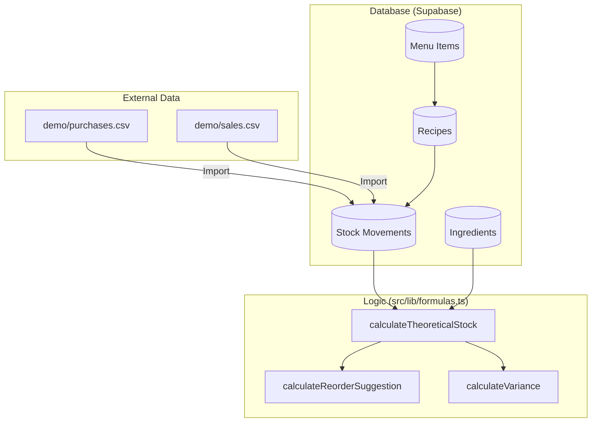

# La Terrasse Diani Beach - Inventory Control

A comprehensive restaurant inventory management web application built with Next.js 15, TypeScript, Tailwind CSS, and Supabase.

## Features

- 📦 **Master Data Management**: Track Ingredients, Suppliers, Menu Items, and Recipes.
- 🚚 **Purchases**: Record incoming stock from suppliers using base units or pack conversions.
- 🍽️ **Sales**: Calculate stock reductions derived from POS sales via recipes.
- 📉 **Movements**: Automatically logs IN, OUT, and ADJ stock entries.
- 📊 **Theoretical vs Physical**: Compare theoretical stock with real physical counts to detect variances.
- ⚠️ **Reorder Alerts**: Suggest reorder quantities when items dip below minimum stock.
- 📥 **CSV Imports**: Included demo CSV files to bulk-upload purchases or sales (useful for POS integration).

## Data Flow Architecture

---

## App Structure

\`\`\`
la-terrasse-inventory/
├── demo/
│   ├── purchases.csv         # Sample CSV for importing supplier purchases
│   └── sales.csv             # Sample CSV for POS single-day sales import
├── src/
│   ├── app/
│   │   ├── layout.tsx        # Main layout containing the Sidebar
│   │   ├── page.tsx          # Dashboard overview
│   │   ├── ingredients/      # Ingredients master table
│   │   ├── inventory-counts/ # Physical count logging & variance
│   │   ├── menu-items/       # POS items setup
│   │   ├── purchases/        # Stock IN transactions
│   │   ├── recipes/          # Menu Item to Ingredient links
│   │   ├── reorders/         # Low stock reordering alerts
│   │   ├── sales/            # POS sales imports (Stock OUT)
│   │   ├── stock/            # Current stock status & alerts preview
│   │   └── suppliers/        # Supplier tracking
│   ├── components/
│   │   └── Sidebar.tsx       # Navigation UI
│   └── lib/
│       ├── page-generator.ts # UI Scaffold helper for stub pages
│       └── formulas.ts       # Backend calculation logic (Theoretical stock, etc.)
└── supabase/
    ├── schema.sql            # The full SQL Database DDL definitions
    └── seed.sql              # Dummy data population for local dev
\`\`\`

---

## Getting Started

Because this environment was set up generically without local Node installation, here are the steps to launch the app:

### 1. Requirements
Ensure you have Node.js (v18+) and npm installed on your machine.
Ensure you have a Supabase account or local Supabase CLI installed.

### 2. Install Dependencies
Navigate inside the project directory and install the packages:

\`\`\`bash
cd /Users/GildasBonny/Documents/1.Project/Devproject/la-terrasse-inventory
npm install
\`\`\`

### 3. Setup Supabase
1. Create a new project in [Supabase](https://supabase.com).
2. Go to the **SQL Editor** in your Supabase Dashboard.
3. Copy and run the code inside `supabase/schema.sql` to generate the tables.
4. Copy and run the code from `supabase/seed.sql` to populate demo data.
5. In your project root, create a \`.env.local\` file with your project keys:

\`\`\`
NEXT_PUBLIC_SUPABASE_URL=https://<your-project-id>.supabase.co
NEXT_PUBLIC_SUPABASE_ANON_KEY=<your-anon-key>
\`\`\`

### 4. Run Development Server
\`\`\`bash
npm run dev
\`\`\`
Visit \`http://localhost:3000\` to view the dashboard interactively.

---

## Technical Details

### Backend Logic & Formulas (\`src/lib/formulas.ts\`)
The app utilizes strict arithmetic rules to compute dynamic values instead of relying purely on spreadsheets.

- **Theoretical Stock**: `(Initial Stock) + (Sum of IN movements) - (Sum of OUT movements) + (Adjustments)`
  - Found in `calculateTheoreticalStock`
- **Reorder Suggestion**: If `Theoretical Stock < Min Stock`, you must reorder `(Max Stock - Theoretical Stock)`. Otherwise 0.
  - Found in `calculateReorderSuggestion`
- **Variance**: Computed comparing a physical count against theoretical value (`var % = (Physical - Theoretical) / Theoretical * 100`).

### Importing CSV Data
You'll locate `demo/purchases.csv` and `demo/sales.csv` in the `demo/` folder. Use these standard formats alongside the `papaparse` library (already installed in `package.json`) to write server actions that parse the file and insert lines seamlessly to the database.

> *Note: By restricting authentication to a basic setup or IP, you save architectural drag initially while easily dropping it in later via Supabase Auth when adding more locations or managers.*
